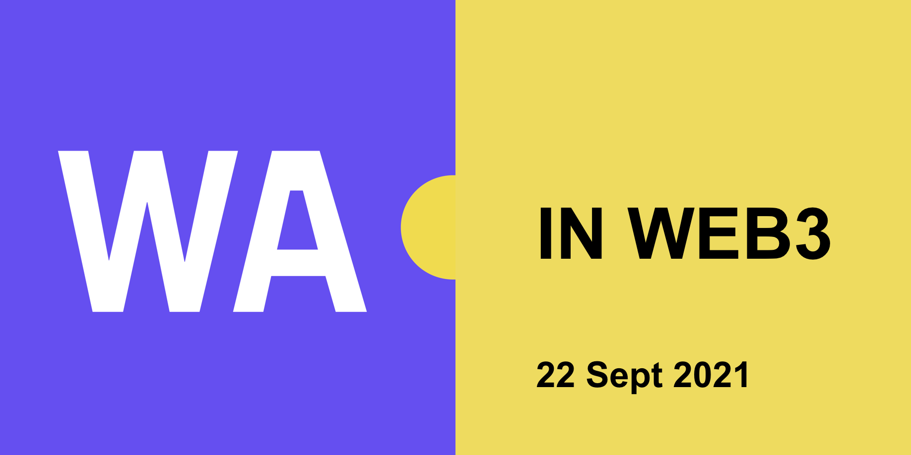

## GOALS
>Explore the key topics involved in building a modern blockchain smart contracts execution environment based on wasm technology.

- Get together people from wasm community together with people working on modern blockchain smart contracts.
- Better understand the challenges, opportunities and requirements for modern blockchain smart contracts execution
- Explore dev toolchains and workflows for coding, debugging and deploying executable code
- Spark collaboration on common cross-project VM and dev workflows specs
- Share learnings and resources between projects

## CONFIRMED TALKS AND HANDS-ON HACKING SESSIONS
- Wasmer.io
- Spacemesh
- Dfinity
- Ethereum
- Fluence
And more...

## TARGET AUDIENCE
Technical people working on blockchain smart contracts projects, web3 projects or on WASM runtimes, compilers and dev tools.

## FORMAT
Workshop. Lightning talks following with a hands-on hacking session and a short Q&A session.

## ATTENDEES (among others)
- Team members from Parity, Wasmer.io, Ethereum/EWASM, Mozilla and Spacemesh
- Andreas Rossberg, Syrus Akbary, Alex Beregszaszi, Pawel Bylica, Andrei Maboroda, Yaron Wittenstein, Aviv Eyal and many more wasm geeks...

## COST
The event is free of charge, if any cost, it might be shared between project participating.

## ATTENDING
[Apply to attend](https://docs.google.com/forms/d/e/1FAIpQLSczgq0BlWyGrfHq7U4FijTyOPLpfjVd8cLMLNncr4ERL74klA/viewform?usp=sf_link).

## AGENDA
A day of presentations and hands-on coding sessions.
Browse the [full schedule 2019; 2021 TBD](https://docs.google.com/spreadsheets/d/1HEsKdtzDHz_Gy-wGu9Z01yDDSdawvdylu9x_tdYFMO0/edit?usp=sharing).

## VENUE
[Online](https://hopin.com//events/wasm-in-web3/)

## CALL FOR SPEAKERS
We have reserved few slots for additional speakers! If you are working on an interesting wasm related blockchain project or on a cool wasm tech which is applicable to blockchains then we please [apply to speak](https://docs.google.com/forms/d/e/1FAIpQLSczgq0BlWyGrfHq7U4FijTyOPLpfjVd8cLMLNncr4ERL74klA/viewform?usp=sf_link).

## GET IN TOUCH
This is a community event organized by people from Fluence, wasm and Spacemesh. Join our [Telegram group](https://t.me/joinchat/Iw4jCW3ryD1kZTVi) for the latest updates.
